# NYC Citi Bike Analysis

This is a summary of the analytic performed with the NYC Citi Bike data and other external data to point that a bike-sharing program in Des Moines is a solid business proposal.

## NYC Citi Bike recap

Here below the major results for NYC Citi Bike.
Each story has been commented.
Only the month of August 2019 has been analyzed as there is likely more traffic during the summer months.

Data have been downloaded directly from [Citi Bike System Data page](https://www.citibikenyc.com/system-data).

**To summarize, the service is mainly used by men, mostly during working commuting hours near touristic and transportation areas. The younger the users are, the longer appear to be the rides. Please note, as it is done on a story below, that the dataset used contains outliers.**

>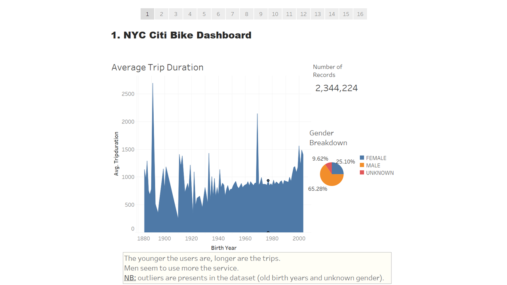

>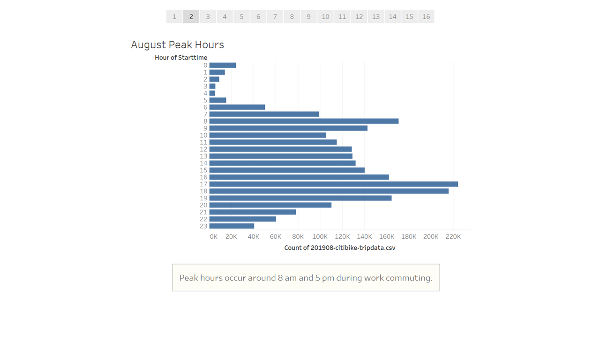

>

>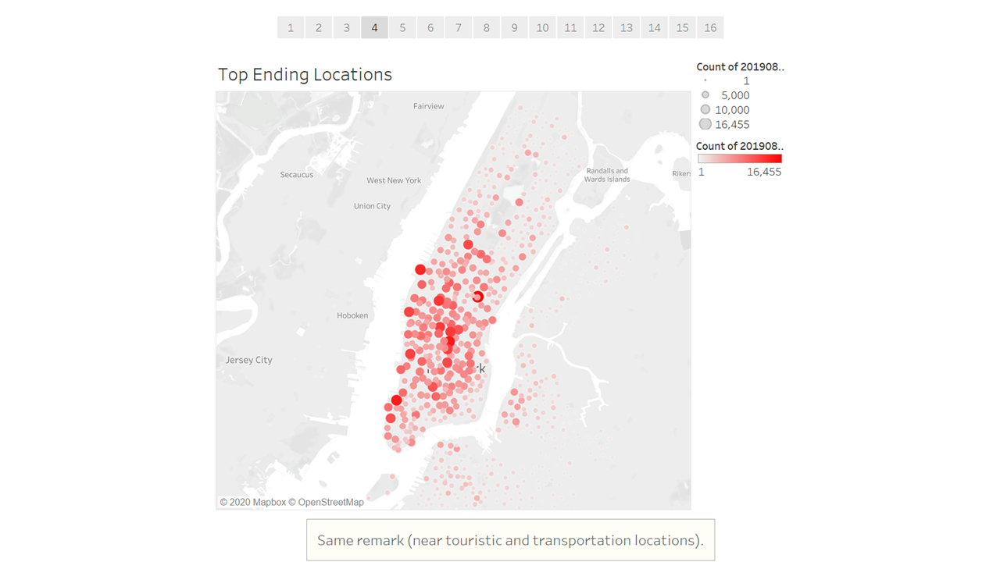

## The bike-sharing company in Des Moines

In order to conclude if a bike-sharing company in Des Moines makes sense, we analyzed multiple factors:
- Comparison between NYC and Des Moines population
    - What is the population of Des Moines?
    - How does its population compare to the population of New York City?
    - Does the population affect the number of people who will use the bike-sharing program?
- The gender diversity between these cities
    - What is the gender diversity of Des Moines?
    - How does it compare to the gender diversity of New York City?
    - What effect does it have on possible business in Des Moines?
- The impact of McDonald's locations on ending trips
    - What is the density of McDonald's in New York City versus Des Moines?
    - Does this affect where people go in the city?
- Weather comparison between the two cities
    - What is the weather in New York City versus Des Moines?
    - Does it have an impact on possible business in Des Moines?
- The economic development
    - What is the economic developement in New York City versus Des Moines?
    - Does it have an impact on possible business in Des Moines?

### Des Moines and NYC population comparison

Here below the major results found.
Each story has been commented.

The analysis where based on:
- [Des Moines and NYC Census Data](https://www.census.gov/quickfacts/fact/table/newyorkcitynewyork,desmoinescityiowa/PST045219)
- [Census Reporter website](https://censusreporter.org/)

**In a nutshell, even if Des Moine is a much more smaller city than NYC, population is quite similar so the use of the service should be the same (in proportion).**

>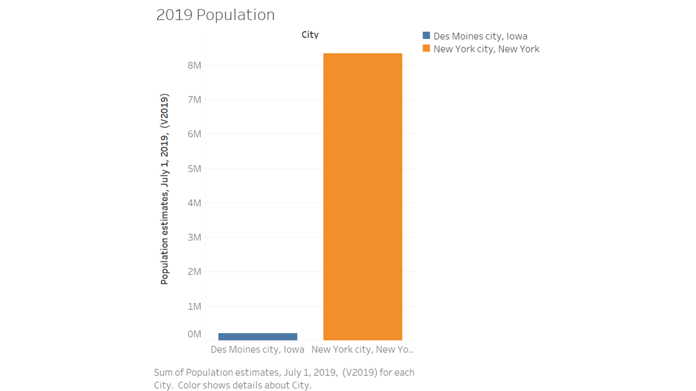

>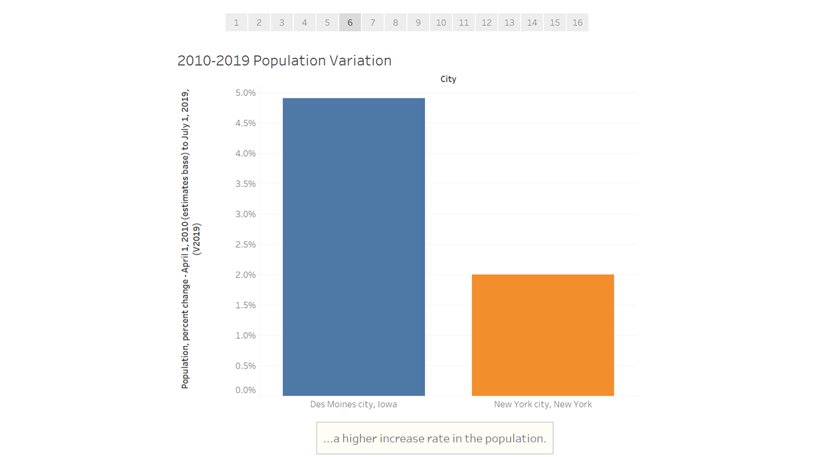

>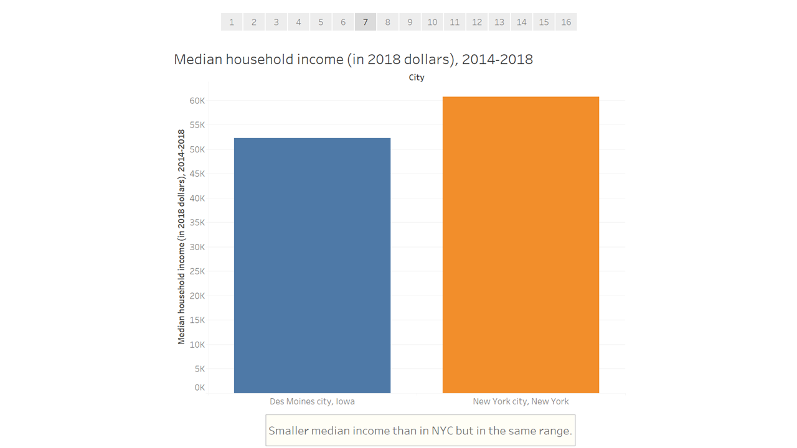

>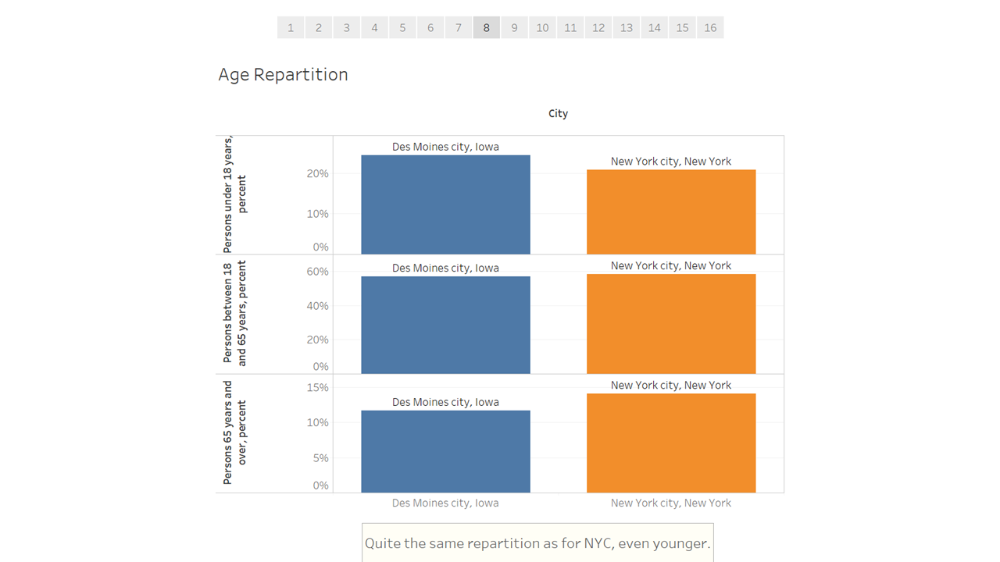

>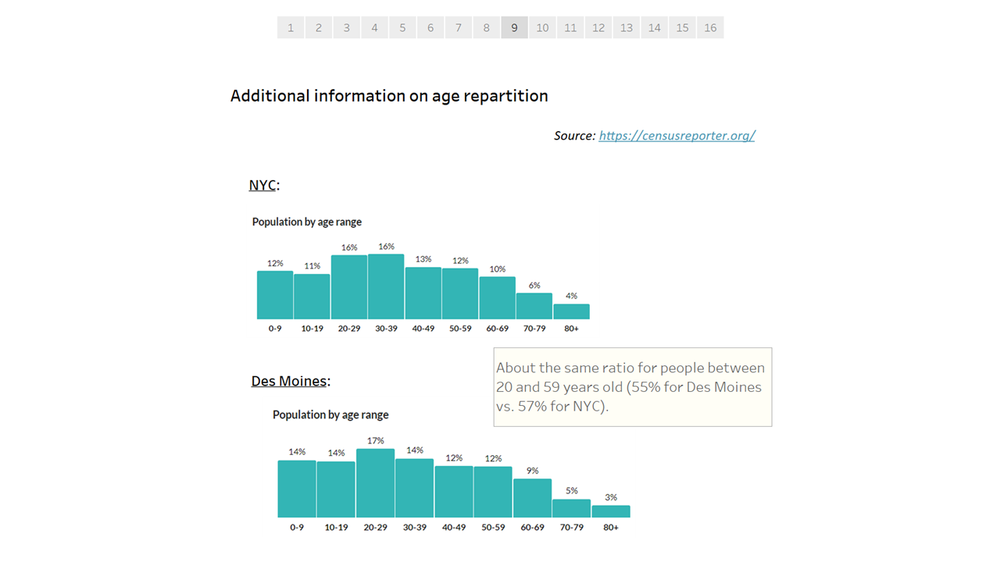

### Des Moines and NYC gender repartition

Here below the major result found.
Each story has been commented.

The analysis where based on:
- [Des Moines and NYC Census Data](https://www.census.gov/quickfacts/fact/table/newyorkcitynewyork,desmoinescityiowa/PST045219)

**As stated previously for population, gender repartition is quite similar between the two cities so NYC results could be forecasted for Des Moines.**

>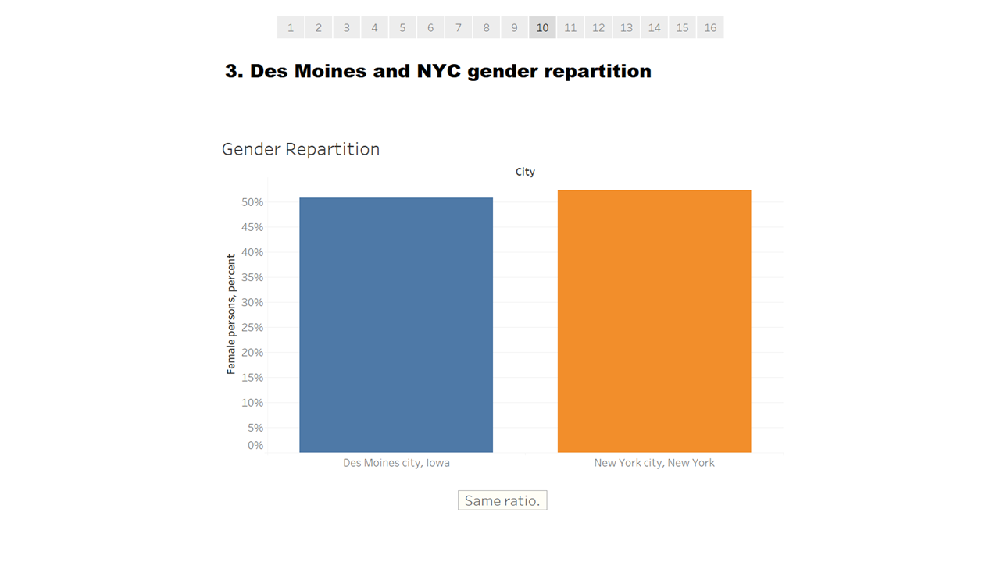

### Density of McDonald's and influence on trips

Here below the major results found.
Each story has been commented.

The analysis where based on csv data provided (cf. [Data](Data/) folder).

**No correlation was found for NYC (ending trip occurs near tourist attractions and transaportation stations) so no prediction could be made for Des Moines. We should experience the same pattern in Iowa.**

>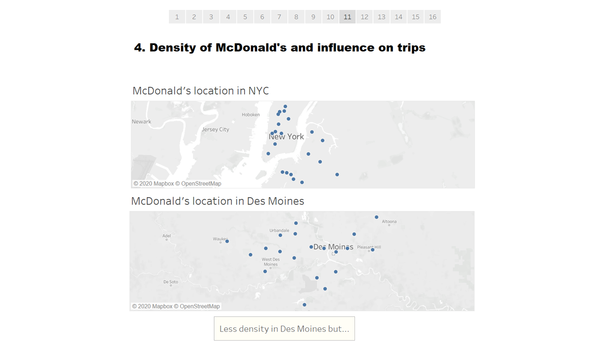

>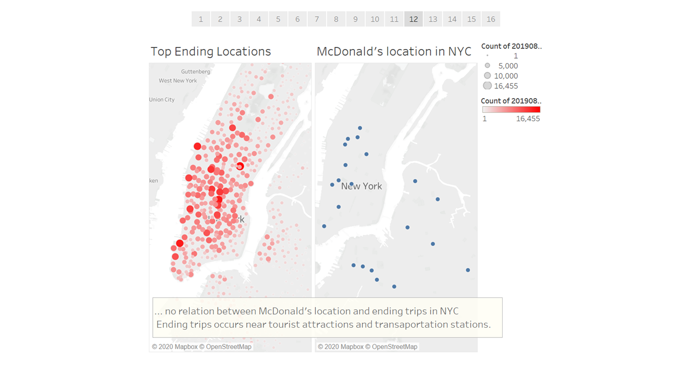

### Weather Comparison

Here below the major results found.
Each story has been commented.

The data were found on the [National Oceanic and Atmospheric Administration website](https://w2.weather.gov/climate/xmacis.php?wfo=okx)

**Des Moines seems to have a dryer and cooler climate than NYC but appears to experience bigger snowfalls. Even tought, the climate should not be a no-go aspect.**

>

>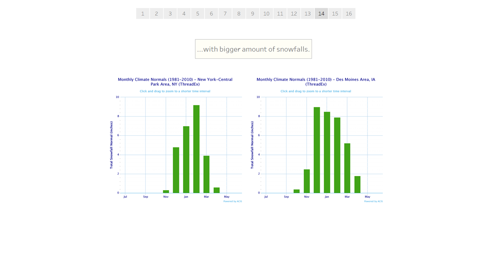

### Economic Comparison

Here below the major results found.
Each story has been commented.

The data were found on the [Federal Reserve Bank of St. Louis website](https://fred.stlouisfed.org/)

**Let's remind that in NYC, peak hours occur around 8 am and 5 pm during work commuting. Thus, economic prosperity is an important factor as the potential users should be more important. Des Moines is a dynamic city, huge plus for us.**

>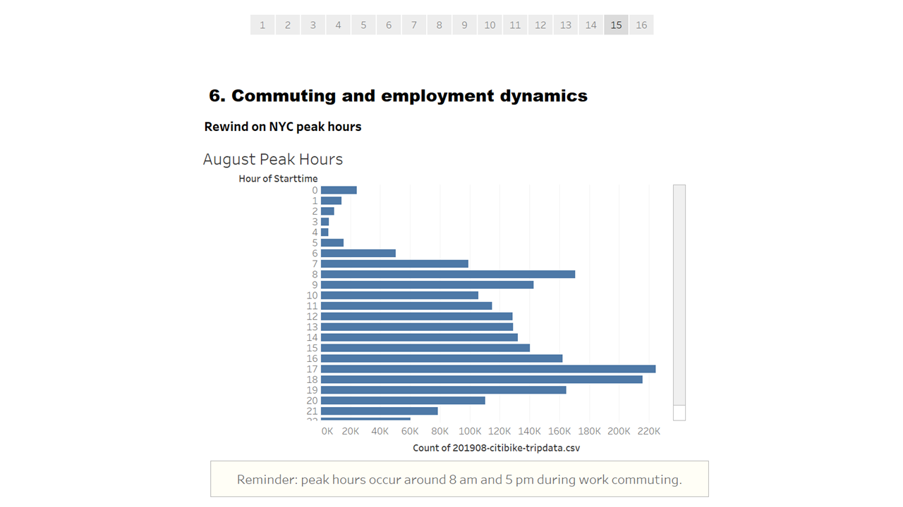

>

### Conclusion

:bike: With all the results presented, starting a bike-sharing program in Des Moines seems definitely to be a good idea! :bike: