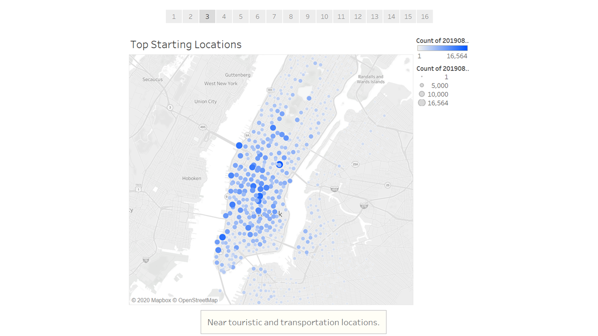
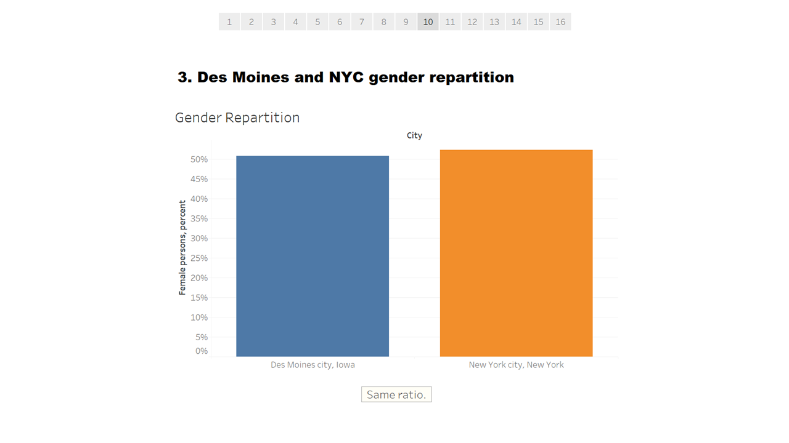

# NYC Citi Bike Analysis

This is a summary of the analytic performed with the NYC Citi Bike data and other external data to point that a bike-sharing program in Des Moines is a solid business proposal.

## NYC Citi Bike recap

Here below the major results for NYC Citi Bike.
Only the month of August 2019 have been analyzed as there is likely more traffic during the summer months.
Data have been downloaded directly from [Citi Bike System Data page](https://www.citibikenyc.com/system-data).
Each story has been commented.

>

>

>

>

## The bike-sharing company in Des Moines

In order to conclude if a bike-sharing comapny in Des Moines makes sense, we analyze multiple factors:
- Comparison between NYC and Des Moines population
- The gender diversity between these cities
- The impact of McDonald's locations on ending trips
- Weather comparison between the two cities
- The economic development

### Des Moines and NYC population comparison

Here below the major results found.
The analysis where based on:
- [Des Moines and NYC Census Data](https://www.census.gov/quickfacts/fact/table/newyorkcitynewyork,desmoinescityiowa/PST045219)
- [Census Reporter website](https://censusreporter.org/)

In a nutshell, even if Des Moine is a much more smaller city than NYC, population are quite similar.

>

>

>

>

>

### Des Moines and NYC gender repartition

Here below the major result found.
The analysis where based on:
- [Des Moines and NYC Census Data](https://www.census.gov/quickfacts/fact/table/newyorkcitynewyork,desmoinescityiowa/PST045219)

As stated previously for population, gender repartition are quite similar between the two cities.

>