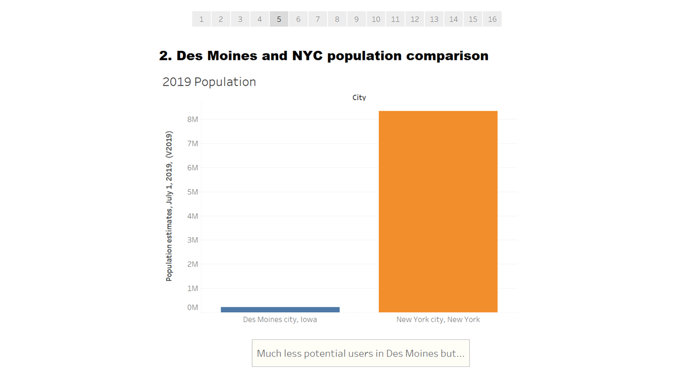
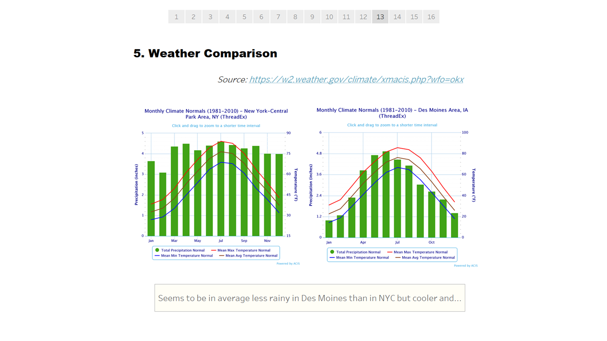
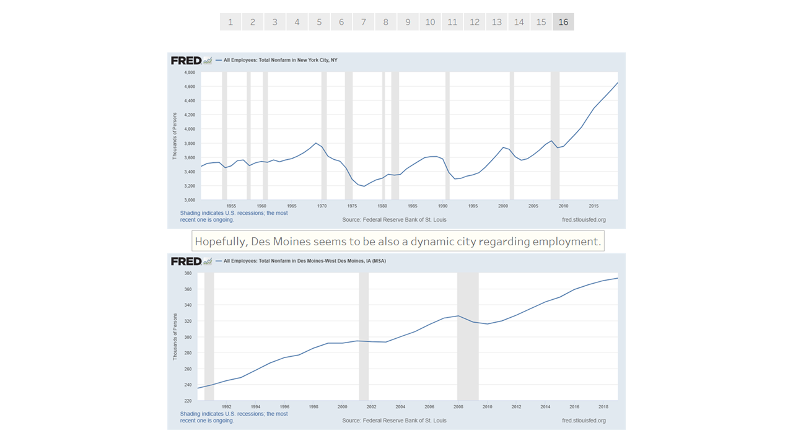

# NYC Citi Bike Analysis

This is a summary of the analytic performed with the NYC Citi Bike data and other external data to point that a bike-sharing program in Des Moines is a solid business proposal.

## NYC Citi Bike recap

Here below the major results for NYC Citi Bike.
Each story has been commented.
Only the month of August 2019 have been analyzed as there is likely more traffic during the summer months.

Data have been downloaded directly from [Citi Bike System Data page](https://www.citibikenyc.com/system-data).

**To summarize, the services is mainly used by men, mostly during working commuting hours near touristic and transportation aeras. The younger the user are, the much longer appears to be the ride. Please note, as it is done on a story below, that the dataset used contains outliers.**

>

>

>

>

## The bike-sharing company in Des Moines

In order to conclude if a bike-sharing comapny in Des Moines makes sense, we analyze multiple factors:
- Comparison between NYC and Des Moines population
- The gender diversity between these cities
- The impact of McDonald's locations on ending trips
- Weather comparison between the two cities
- The economic development

### Des Moines and NYC population comparison

Here below the major results found.
Each story has been commented.

The analysis where based on:
- [Des Moines and NYC Census Data](https://www.census.gov/quickfacts/fact/table/newyorkcitynewyork,desmoinescityiowa/PST045219)
- [Census Reporter website](https://censusreporter.org/)

**In a nutshell, even if Des Moine is a much more smaller city than NYC, population are quite similar.**

>

>

>

>

>

### Des Moines and NYC gender repartition

Here below the major result found.
Each story has been commented.

The analysis where based on:
- [Des Moines and NYC Census Data](https://www.census.gov/quickfacts/fact/table/newyorkcitynewyork,desmoinescityiowa/PST045219)

**As stated previously for population, gender repartition are quite similar between the two cities.**

>

### Density of McDonald's and influence on trips

Here below the major result found.
Each story has been commented.

The analysis where based on csv data provided (cf. [Data](Data/) folder).

**No correlation was found for NYC, so no prediction could be mnade for Des Moines**

>

>

### Weather Comparison

Here below the major result found.
Each story has been commented.

The data were found on the [National Oceanic and Atmospheric Administration website](https://w2.weather.gov/climate/xmacis.php?wfo=okx)

**Des Moines seems to have a dryer and cooler climate than NYC but appears to experience bigger snowfalls. Even tought, the climate should not be a no-go aspect.**

>

>

### Economic Comparison

Here below the major result found.
Each story has been commented.

The data were found on the [Federal Reserve Bank of St. Louis website](https://fred.stlouisfed.org/)

**Let's remind that in NYC, peak hours occur around 8 am and 5 pm during work commuting. Thus, economic prosperity is so important factor as the potential users should be more important. Des Moines is a dynamic city, hudge plus for us.**

>

>

### Conclusion

:bike: With all the results presented, starting a bike-sharing program in Des Moines seems definitely to be a good idea! :bike: